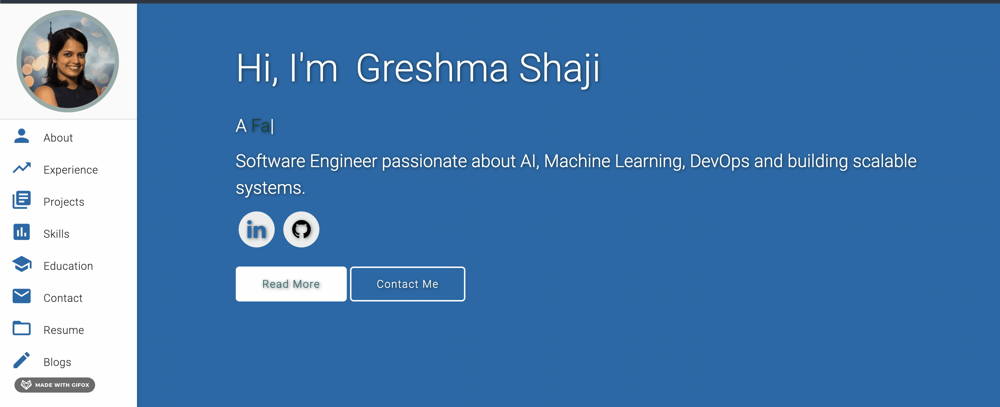

# Greshma Shaji | Portfolio 🌐
> Welcome to my personal portfolio! This is a clean, modern, and responsive portfolio template designed specifically for software developers. Show off your skills, projects, and experience in style.

> https://greshmashaji.github.io

[](https://greshmashaji.github.io)
[](https://medium.com/@greshmashaji)
[](https://github.com/GreshmaShaji/greshmashaji.github.io/commits/main/)
[](https://www.linkedin.com/in/greshma-shaji-1825941b6/)
[](http://badges.mit-license.org)

### Website Preview
<p align="center"> 
  <kbd>
    <a href="https://greshmashaji.github.io" target="_blank">
  </a>
  </kbd>
</p>

## Features 📋
⚡️ Fully Responsive\
⚡️ Valid HTML5 & CSS3\
⚡️ Typing animation using `Typed.js`\
⚡️ Easy to Customize and Modify
⚡️ Smooth Navigation and Beautiful UI

## Installation & Deployment 📦
To get started with your own version of this portfolio, follow these simple steps:
- Clone the Repository: Clone the repository to your local machine using:
```
git clone https://github.com/GreshmaShaji/greshmashaji.github.io.git
```

- Modify the content in the <b>index.html</b> file to reflect your personal information, projects, and experience.
- Add or remove images from `greshmashaji.github.io/assets/img/` directory as per your requirement.
- I highly recommend to use [Github Pages](https://create-react-app.dev/docs/deployment/#github-pages) to deploy the website the EASIEST WAY.
- To deploy your website, first you need to create github repository with name `<your-github-username>.github.io`. Please don't give any other name.
- Push the generated code to the `main` branch of this repository.
- <b>💡 Tip:</b> Make sure to set `analyticsId` from your Google Analytics account inside the Google Analytics script tag, if you want to use your own Google Analytics account.

## Sections 📚
This portfolio includes the following sections:

✔️ About Me: A brief introduction and background.
✔️ Experience: Details of your professional journey.
✔️ Projects: Showcase your development projects.
✔️ Skills: Highlight your technical expertise.
✔️ Education: Your academic credentials.
✔️ Contact Info: How people can reach you.
✔️ Resume: A downloadable link to your resume.
✔️ Blogs: A list of blog articles.

To view a live demo, visit the link above

## Tools Used 🛠️
* [<b>GitHub Pages</b>](https://create-react-app.dev/docs/deployment/#github-pages) - To host my static website (HTML, CSS, JS).
* [<b>Materialize</b>](https://materializecss.com/) - A CSS framework to get Google's Material Design components.
* [<b>Typed.js</b>](https://mattboldt.com/demos/typed-js/) - JavaScript Library

## Contributing 💡
#### Step 1

- **Option 1**
    - 🍴 Fork this repo!

- **Option 2**
    - 👯 Clone this repo to your local machine.


#### Step 2

- **Build your code** 🔨🔨🔨

#### Step 3

- 🔃 Create a new pull request.

## License 📄
This project is licensed under the MIT License - see the [LICENSE.md](./LICENSE) file for details.

⭐ Star this project if you find it helpful! It helps me a lot!